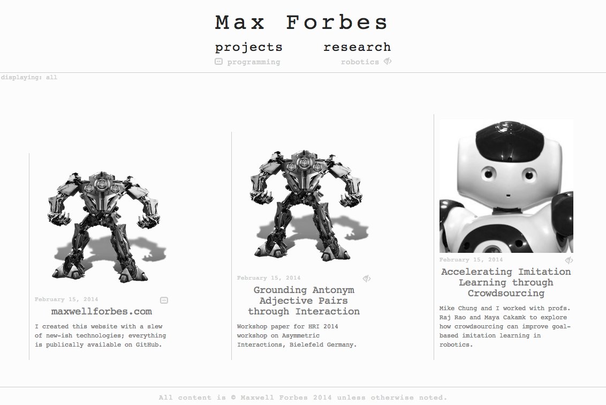

# prjpages

A website with Node, Jade, SASS and more.

## About
This is a personal website whose primpary purpose is to showcase the projects I work on.

* Having last used Rails, I wanted to check out the Next Cool Thing, so I wrote the sever in Node1.
* I wanted to make it extremely easy to write posts, so I write them in Markdown.
* I also wanted to make it easy to include structured data, so I use CSON (think JSON + Coffeescript).
* I wanted to make the HTML reusable and small, so I write it in Jade.
* I wanted a responsive, mobile-friendly website, so I use Bootstrap.
* I wanted my stylesheets to be easily-customizable and changeable, so I wrote them in SASS.
* I wanted others to use this if they wanted to, so the license is MIT.

1: _As much as one needs to write a server in Node---it practically writes itself._

## TODOs:
* simple path matching (express)
* launch
* make heroku commands to compile bootstrap and generate sass so that I don't track them. currently tracking that I don't want to:
  * public/css/bootstrap.min.css
  * public/js/bootstrap.min.js
  * public/fonts/*
  * public/css/pt_prj.css
However, this could be a little complicated because heroku would have to actually pull the bootstrap source because I don't want to track that either. Just compiling the scss would be a good start.

* add back in support for IE 8, etc. (see comments in views/head.jade)

## Notes:
* My phone's screen width is 360px, so that should be the minimum resolution width supported (if not smaller...)